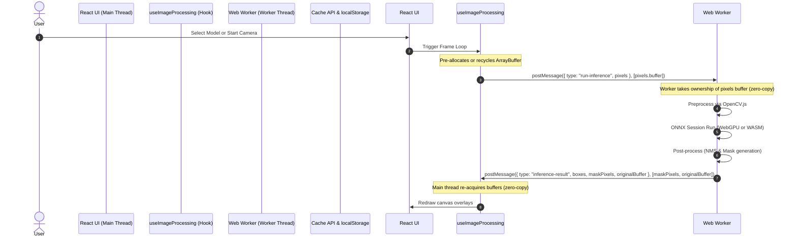

# Application Architecture Spec

This document details the architectural boundaries, module hierarchy, and data flow of the YOLO11 ONNX web application.

## 1. System Block Diagram

The application is structured to isolate the CPU-heavy ONNX Runtime execution and OpenCV image processing inside a **Web Worker**. This keeps the React main thread free to handle animations and rendering at 60 FPS.



---

## 2. Module & Seam Hierarchy

### A. React UI Layer (`src/app/page.tsx`)
Coordinates all state and hook interfaces:
*   **`useYoloModel`**: Owns the worker instance and manages the lifecycle of the active ONNX model session.
*   **`useImageProcessing`**: Owns canvas elements, frame loops, and coordinates message routing to/from the worker for frames.
*   **`useCamera`**: Performs device enumeration and holds active webcam media stream tracks.
*   **`useFps`**: Provides lightweight delta-time tracking to measure processed frames per second.

### B. The Main Thread ↔ Web Worker Seam (`src/workers/`)
This is the primary performance seam of the application. It acts as a bridge between React's declarative state changes and the worker's imperative pipeline.

*   **`inferenceWorker.ts`**: The entrypoint for the worker thread. It holds the active `ort.InferenceSession` in a worker-global scope. It listens for `load-model`, `run-inference`, `release`, and `invalidate-cache` messages.
*   **`workerPipeline.ts`**: Implements the step-by-step pipeline from pixels to bounding boxes and mask overlays.
*   **`validationWorker.ts`**: Validates custom uploaded models (runs checks to make sure the session initializes properly and conforms to input shape requirements).

### C. Persistent Storage Seam (`src/utils/model_cache.ts`)
Decouples model binary storage from the network:
*   **Cache API (`yolo-model-cache-v1`)**: Stores large `.onnx` files (both built-in and custom user uploads) as binary blobs. Compatible with both the main thread and Web Workers.
*   **`localStorage` (`yolo-custom-models`)**: Stores metadata (class names, custom model URLs, capabilities) for user-uploaded models.

---

## 3. Data Flow & Communication Contracts

### Model Loading Protocol (`load-model`)
When the model name or execution provider (WebGPU/WASM) changes, the main thread signals the worker to transition sessions:
```typescript
interface LoadModelMessage {
  type: "load-model";
  device: "webgpu" | "wasm";
  modelPath: string; // URL path or Cache API key
  config: Config;    // model config details
  forceReload?: boolean; // clear cache and re-download
}
```

### Real-time Inference Protocol (`run-inference`)
For every frame (camera or static image), raw image pixels are sent across the seam.
```typescript
interface RunInferenceMessage {
  type: "run-inference";
  pixels: Uint8ClampedArray; // transferred buffer
  srcWidth: number;
  srcHeight: number;
  overlayWidth: number;
  overlayHeight: number;
  config: Config;
}
```

### Inference Result Protocol (`inference-result`)
The worker post-processes the outputs and transfers ownership of the resulting mask pixels back to the main thread.
```typescript
interface InferenceResult {
  type: "inference-result";
  boxes: WorkerBox[];      // bounding boxes and keypoints
  inferenceTime: string;   // execution time in ms
  maskPixels: Uint8ClampedArray | null; // segmented mask overlay
  maskWidth: number;
  maskHeight: number;
  originalBuffer: ArrayBufferLike;      // recycled pixel buffer
}
```

---

## 4. Performance Optimizations

### Zero-Copy Transferable Objects
Instead of copying millions of pixel values across threads on every frame (which blocks both threads), the application uses **Transferable Objects**.
By passing the buffer as the second argument of `postMessage` (`postMessage(msg, [pixels.buffer])`), the main thread releases ownership, and the worker accesses the raw memory block instantly with zero serialization overhead.

### Buffer Recycling
To prevent memory fragmentation and GC pauses, the main thread pre-allocates an ArrayBuffer via `pixelBufferRef`. It transfers this buffer to the worker, and when the worker is done, it transfers the *exact same buffer back* to the main thread via `originalBuffer`. This forms a closed loop of zero-allocation memory.

### Back-pressure Safeguard (`workerBusyRef`)
To prevent the Web Worker's execution queue from growing indefinitely during webcam feeds, a lock is set:
```typescript
// Only send to worker if it is NOT busy
if (!workerBusyRef.current && workerReadyRef.current) {
  workerBusyRef.current = true;
  worker.postMessage({ ... }, [pixels.buffer]);
}
```
If the worker is still running inference on the previous frame when a new `requestAnimationFrame` fires, the frame is skipped, maintaining a responsive UI and preventing frame queues from building up.
